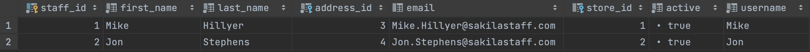
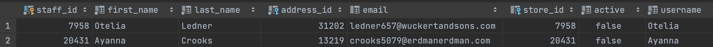
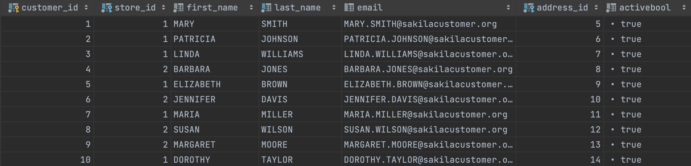
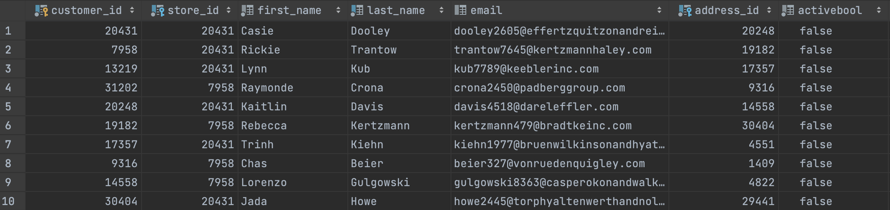
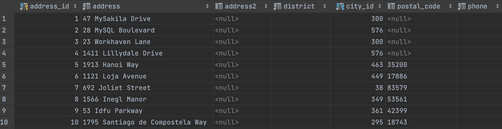
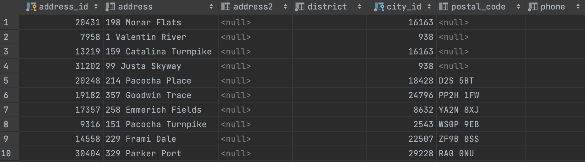
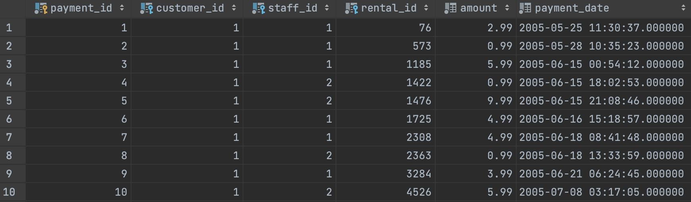
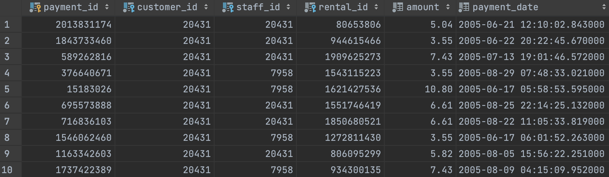
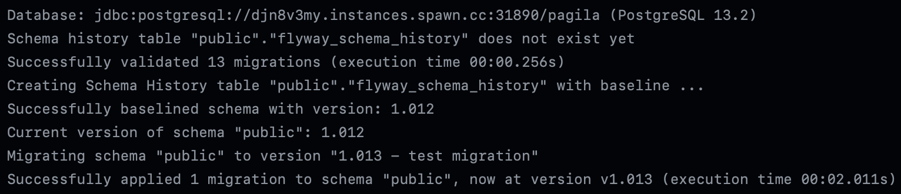

# :rocket: Demo: Flyway, Spawn and Synthesized TDK to test database migrations

This demo repo is an example of how to use [Flyway](https://flywaydb.org/), [Spawn](https://spawn.cc/) and [TDK](https://docs.synthesized.io/tdk/latest/) to test database migrations with GitHub Actions.

This demo is based on a tutorial from Flyway documentation [Testing Flyway migrations in a CI pipeline](https://flywaydb.org/documentation/tutorials/migrationtesting). In addition, we use TDK to mask production data. As the result, production data doesn't leave production environment.

TDK configuration can be found in the `./tdk` directory. As you can see we mask all columns by default, but we on top of that we create realistic names, emails and addresses.

## Table of contents

- [Preparation](#Preparation)
- [Running](#Running)
- [Screenshots](#Screenshots)

## Preparation 

Before running the demo we need to prepare RDS database.

Before starting change the directory:

```bash
cd rds
```

1. Create a new RDS database instance in AWS. The database should be publicly accessible and have a username and password set.

```bash
PGPASSWORD=<RDS_PASSWORD> ./create-pagila-db.sh
```

Check the status of the database instance and wait when it's active.

2. Insert the data into the database.

Got to AWS RDS console and copy the endpoint of the database. Then run the following command:

```bash
PAGILA_HOST=<RDS_HOST> PAGILA_USERNAME=postgres PAGILA_PASSWORD=<RDS_PASSWORD> ./insert-data.sh 
```

3. Create GitHub secretes

You need to set following variables:
- `PAGILA_HOST`
- `PAGILA_ADMIN_USERNAME`
- `PAGILA_ADMIN_PASSWORD`

## Running

1. Take prod db snapshot.

- Go to GitHub Actions
- Click `Take backup of production database daily`
- Click `Run workflow`
- Check logs

This should trigger a job which will create a Spawn snapshot containing masked production data.

2. Run migrations test

- Go to GitHub Actions
- Click `Database migration test`
- Click `Run workflow`
- Check logs

In the logs you should see how we spaw a data container using a prod snapshot from the step 1. and run the last migration (number 13).

## Screenshots

1. Comparison of prod and snapshot data.

Staff table Prod vs Snapshot:



Customer table Prod vs Snapshot:



Address table Prod vs Snapshot:



Payment table Prod vs Snapshot:



Please note that sensetive values such as names, emails and addresses are masked with realistic values.
Primary keys and payment amounts are also masked as you can see.

3. Sample log of successful migration



Migration runs successfully. Given that the schema of snapshot database is exactly the same as the production one,
we can be sure that the migration will run successfully in production too.